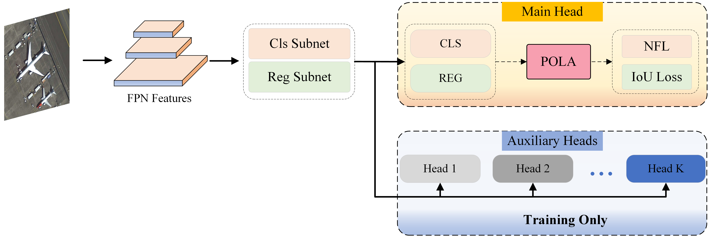
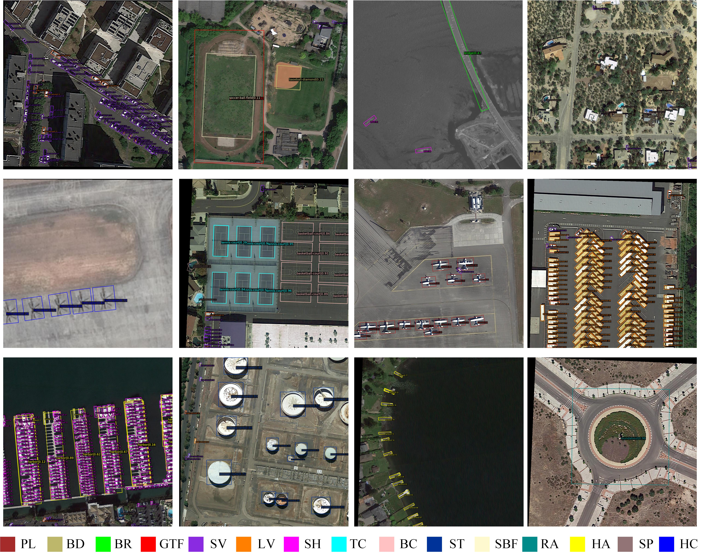
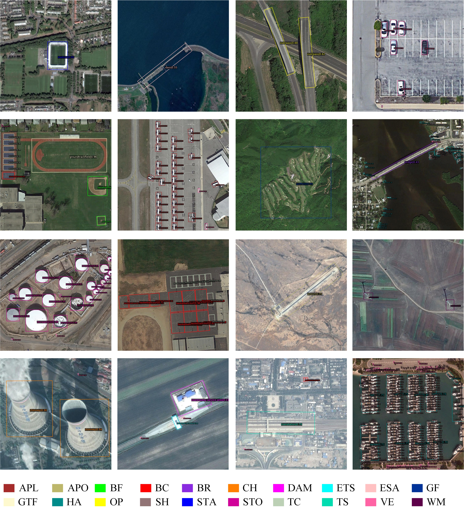

# EOOD
End-to-End One-Stage Oriented Object Detection

## Introduction

### Some Results

## Installation

Please refer to [install.md](docs/en/install.md) for installation guide.

## Get Started

Please see [get_started.md](docs/en/get_started.md) for the basic usage of MMRotate.

## Data Preparation

Please refer to [data_preparation.md](tools/data/README.md) to prepare the data.

## Acknowledgement

MMRotate is an open source project that is contributed by researchers and engineers from various colleges and companies. We appreciate all the contributors who implement their methods or add new features, as well as users who give valuable feedbacks. We wish that the toolbox and benchmark could serve the growing research community by providing a flexible toolkit to reimplement existing methods and develop their own new methods.

